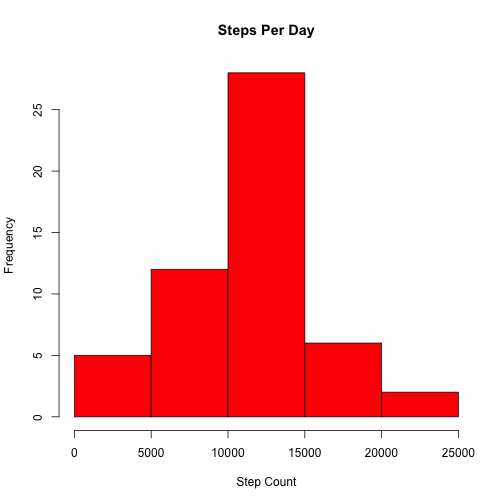
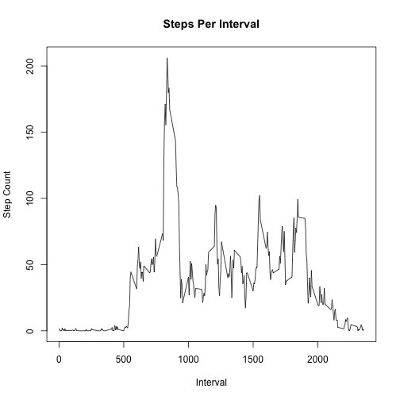
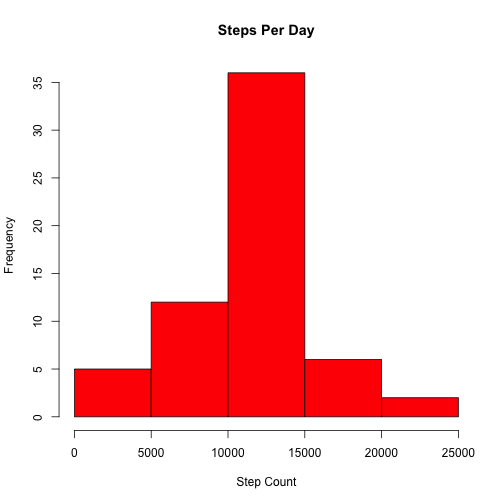
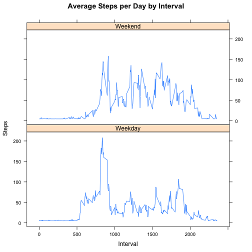

This file contains the steps and data required for Project 1 of Reproducible Research.

<br/>
Step 1: Load Data

```r
data<-read.csv("activity.csv")
```

<br/>
Step 2a: Calculate total number of steps per day and plot it using a histogram

```r
steps_per_day<-aggregate(steps ~ date,data, sum)
hist(steps_per_day$steps,col="red",main="Steps Per Day", xlab="Step Count")
```

 

<br/>
Step 2b: Calculate mean and median of steps per day

```r
mean(steps_per_day$steps)
```

```
## [1] 10766.19
```

```r
median(steps_per_day$steps)
```

```
## [1] 10765
```

<br/>
Step 3a: Calculate and plot average steps per interval

```r
mean_steps_per_interval <- aggregate(steps ~ interval, data, mean)
plot(mean_steps_per_interval$interval, mean_steps_per_interval$steps, xlab="Interval", ylab="Step Count",main="Steps Per Interval", type="l")
```

 

<br/>
Step 3b: Calculate interval with max number of steps

```r
mean_steps_per_interval[which.max(mean_steps_per_interval$steps),1]
```

```
## [1] 835
```

<br/>
Step 4a: Count number of NAs

```r
sum(is.na(data))
```

```
## [1] 2304
```

<br/>
Step 4b: Replace NAs with mean of average steps per day

```r
mean_steps_per_day<-aggregate(steps ~ date, data, mean)
mean_steps<-mean(mean_steps_per_day$steps)
newdata<- data
newdata[is.na(newdata)]<-mean_steps
```

<br/>
Step 4c: Recalculate steps per day and create histogram

```r
new_steps_per_day<-aggregate(steps ~ date,newdata, sum)
hist(new_steps_per_day$steps,col="red",main="Steps Per Day", xlab="Step Count")
```

 

<br/>
Step 4d: Recalculate mean and median

```r
mean(new_steps_per_day$steps)
```

```
## [1] 10766.19
```

```r
median(new_steps_per_day$steps)
```

```
## [1] 10766.19
```

Due to the large number of NAs, the mean and median would be skewed towards whichever value was used to replace them. Since an average of average steps per day was used, the overall dataset was skewed towards a central baseline, reducing variability.

<br/>
Step 5a: Add extra column to dataset denoting weekday/weekend

```r
days <- c("Monday", "Tuesday", "Wednesday", "Thursday", "Friday")
newdata$day = as.factor(ifelse(is.element(weekdays(as.Date(newdata$date)),days), "Weekday", "Weekend"))
```

<br/>
Step 5b: Create plot comparison of steps on weekday vs steps on weekend

```r
library(lattice)
steps_per_interval_compare <- aggregate(steps ~ interval + day, newdata, mean)
xyplot(steps_per_interval_compare$steps ~ steps_per_interval_compare$interval|steps_per_interval_compare$day, main="Average Steps per Day by Interval",xlab="Interval", ylab="Steps",layout=c(1,2), type="l")
```

 
